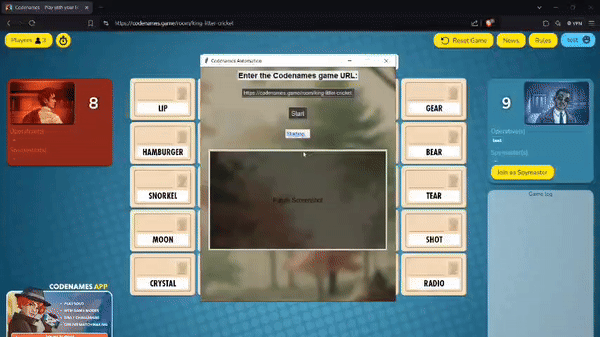

# Codenames Game Automation

This script automates capturing a screenshot of a Codenames online game as spymaster using Selenium then leaves.
It navigates the game, enters a nickname, joins as Spymaster, and switches to Spectator mode. 
A screenshot is taken and processed with Pillow for resizing and image enhancements.

It goes fast enough to where nobody notices, Ive used it in live lobbies in discords and out of 20 times 1 person noticed in 1 game.
## Demo GIF

Instructions on how to use the tool...

all you have to do is press start

you need firefox and make sure it is in the right directory.
